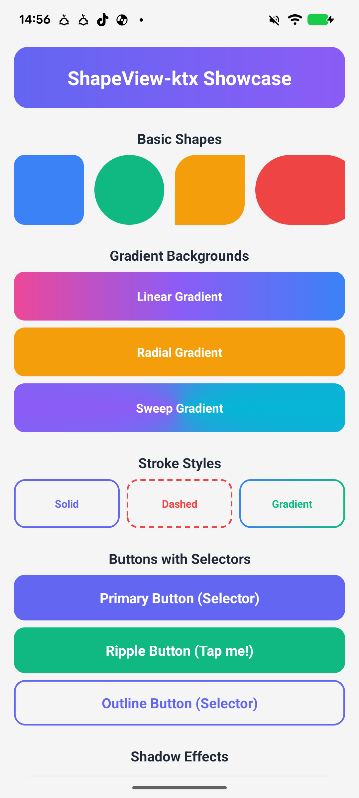
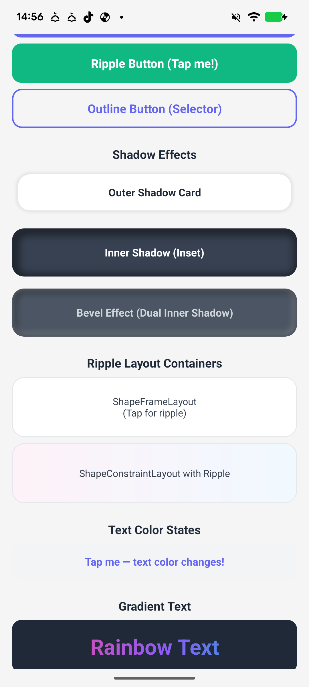
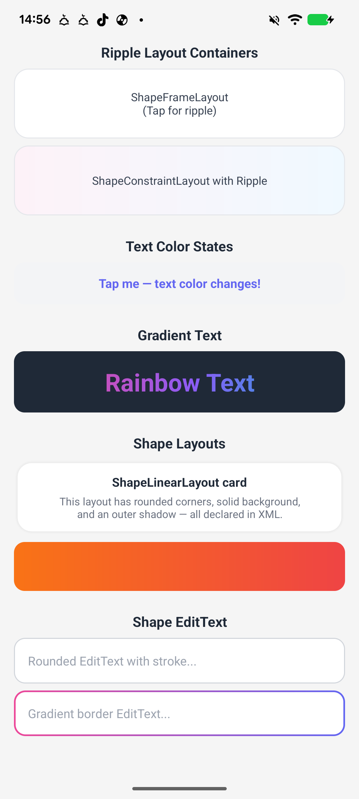

# ShapeView-ktx

[](https://central.sonatype.com/artifact/io.github.impeterwayne/shape-view)
[](https://android-arsenal.com/api?level=23)
[](https://opensource.org/licenses/Apache-2.0)

An Android library that eliminates `shape` drawable XML files. Define shapes, gradients, strokes, shadows, ripples, and state colors **directly in your layout XML** — no more `drawable/` boilerplate.

## Features

- **Shape types** — Rectangle, oval, line, ring
- **Corner radius** — Uniform or per-corner (`topLeft`, `topRight`, `bottomLeft`, `bottomRight`)
- **Solid colors with states** — `default`, `pressed`, `checked`, `disabled`, `focused`, `selected`
- **Gradient backgrounds** — Linear, radial, sweep with configurable orientation, center, radius, and color-stop positions
- **Stroke** — Solid, dashed, and gradient strokes with state colors
- **Shadows** — Outer shadow + dual inner shadows (for bevel/inset effects)
- **Text color states** — State-aware text colors declared in XML
- **Gradient text** — Horizontal/vertical gradient text rendering
- **Text stroke** — Outlined text with configurable stroke color and size
- **Ripple effect** — Built-in ripple support on all views via `shape_ripple_enabled`, `shape_ripple_color`, and `shape_ripple_radius`
- **Button drawables** — State-aware CheckBox/RadioButton icon drawables

---

## Screenshots

<p align="center">
  
  
  
</p>

---

## Installation

### Gradle (Maven Central)

```groovy
dependencies {
    implementation 'io.github.impeterwayne:shape-view:1.0.0'
}
```

---

## Views

| View | Extends |
|------|---------|
| `ShapeView` | `View` |
| `ShapeTextView` | `TextView` |
| `ShapeButton` | `Button` |
| `ShapeEditText` | `EditText` |
| `ShapeImageView` | `ImageView` |
| `ShapeCheckBox` | `CheckBox` |
| `ShapeRadioButton` | `RadioButton` |

## Layouts

| Layout | Extends |
|--------|---------|
| `ShapeLinearLayout` | `LinearLayout` |
| `ShapeFrameLayout` | `FrameLayout` |
| `ShapeRelativeLayout` | `RelativeLayout` |
| `ShapeConstraintLayout` | `ConstraintLayout` |
| `ShapeRadioGroup` | `RadioGroup` |
| `ShapeRecyclerView` | `RecyclerView` |

---

## Quick Examples

### Rounded gradient button

```xml
<com.genesys.shape.view.ShapeButton
    android:layout_width="match_parent"
    android:layout_height="52dp"
    android:text="Submit"
    android:textColor="#FFFFFF"
    app:shape_radius="12dp"
    app:shape_solidGradientStartColor="#6366F1"
    app:shape_solidGradientEndColor="#8B5CF6"
    app:shape_solidGradientOrientation="leftToRight"
    app:shape_solidPressedColor="#4F46E5" />
```

### Card with shadow

```xml
<com.genesys.shape.layout.ShapeLinearLayout
    android:layout_width="match_parent"
    android:layout_height="wrap_content"
    android:padding="16dp"
    app:shape_radius="16dp"
    app:shape_solidColor="#FFFFFF"
    app:shape_outerShadowSize="8dp"
    app:shape_outerShadowColor="#30000000" />
```

### Ripple-enabled container

```xml
<com.genesys.shape.layout.ShapeFrameLayout
    android:layout_width="match_parent"
    android:layout_height="80dp"
    app:shape_radius="16dp"
    app:shape_solidColor="#FFFFFF"
    app:shape_ripple_enabled="true"
    app:shape_ripple_color="#206366F1" />
```

### Outlined input field

```xml
<com.genesys.shape.view.ShapeEditText
    android:layout_width="match_parent"
    android:layout_height="48dp"
    android:hint="Enter your name"
    android:paddingHorizontal="16dp"
    app:shape_radius="8dp"
    app:shape_solidColor="#FFFFFF"
    app:shape_strokeColor="#D1D5DB"
    app:shape_strokeSize="1dp"
    app:shape_strokeFocusedColor="#6366F1" />
```

### Neumorphic bevel effect (dual inner shadows)

```xml
<com.genesys.shape.layout.ShapeConstraintLayout
    android:layout_width="200dp"
    android:layout_height="200dp"
    app:shape_radius="24dp"
    app:shape_solidColor="#E0E5EC"
    app:shape_innerShadowSize="6dp"
    app:shape_innerShadowColor="#40000000"
    app:shape_innerShadowOffsetX="4dp"
    app:shape_innerShadowOffsetY="4dp"
    app:shape_innerShadow2Size="6dp"
    app:shape_innerShadow2Color="#80FFFFFF"
    app:shape_innerShadow2OffsetX="-4dp"
    app:shape_innerShadow2OffsetY="-4dp" />
```

### Gradient text

```xml
<com.genesys.shape.view.ShapeTextView
    android:layout_width="wrap_content"
    android:layout_height="wrap_content"
    android:text="Gradient Text"
    android:textSize="24sp"
    app:shape_textStartColor="#6366F1"
    app:shape_textEndColor="#EC4899"
    app:shape_textGradientOrientation="horizontal" />
```

---

## Attribute Reference

### Shape

| Attribute | Format | Description |
|-----------|--------|-------------|
| `shape_type` | `enum` | `rectangle` · `oval` · `line` · `ring` |
| `shape_width` | `dimension` | Explicit shape width |
| `shape_height` | `dimension` | Explicit shape height |

### Corner Radius

| Attribute | Format |
|-----------|--------|
| `shape_radius` | `dimension` |
| `shape_radiusInTopLeft` / `shape_radiusInTopStart` | `dimension` |
| `shape_radiusInTopRight` / `shape_radiusInTopEnd` | `dimension` |
| `shape_radiusInBottomLeft` / `shape_radiusInBottomStart` | `dimension` |
| `shape_radiusInBottomRight` / `shape_radiusInBottomEnd` | `dimension` |

### Solid / Background Color

| Attribute | Format | State |
|-----------|--------|-------|
| `shape_solidColor` | `color` | Default |
| `shape_solidPressedColor` | `color` | Pressed |
| `shape_solidCheckedColor` | `color` | Checked |
| `shape_solidDisabledColor` | `color` | Disabled |
| `shape_solidFocusedColor` | `color` | Focused |
| `shape_solidSelectedColor` | `color` | Selected |

### Background Gradient

| Attribute | Format | Description |
|-----------|--------|-------------|
| `shape_solidGradientStartColor` | `color` | Start color |
| `shape_solidGradientCenterColor` | `color` | Center color (optional) |
| `shape_solidGradientEndColor` | `color` | End color |
| `shape_solidGradientOrientation` | `enum` | `leftToRight` · `topToBottom` · `topLeftToBottomRight` … |
| `shape_solidGradientType` | `enum` | `linear` · `radial` · `sweep` |
| `shape_solidGradientCenterX/Y` | `float` | Center position (0.0–1.0) |
| `shape_solidGradientRadius` | `dimension` | Radial gradient radius |
| `shape_solidGradientStartPercent` | `float` | Color-stop position for start |
| `shape_solidGradientCenterPercent` | `float` | Color-stop position for center |
| `shape_solidGradientEndPercent` | `float` | Color-stop position for end |

### Stroke

| Attribute | Format | Description |
|-----------|--------|-------------|
| `shape_strokeColor` | `color` | Default stroke color |
| `shape_strokePressedColor` | `color` | Pressed state |
| `shape_strokeCheckedColor` | `color` | Checked state |
| `shape_strokeDisabledColor` | `color` | Disabled state |
| `shape_strokeFocusedColor` | `color` | Focused state |
| `shape_strokeSelectedColor` | `color` | Selected state |
| `shape_strokeSize` | `dimension` | Stroke width |
| `shape_strokeDashSize` | `dimension` | Dash length (0 = solid) |
| `shape_strokeDashGap` | `dimension` | Gap between dashes |
| `shape_strokeGradientStartColor` | `color` | Gradient stroke start |
| `shape_strokeGradientCenterColor` | `color` | Gradient stroke center |
| `shape_strokeGradientEndColor` | `color` | Gradient stroke end |

### Shadow

| Attribute | Format | Description |
|-----------|--------|-------------|
| `shape_outerShadowSize` | `dimension` | Outer shadow blur radius |
| `shape_outerShadowColor` | `color` | Outer shadow color |
| `shape_outerShadowOffsetX` | `dimension` | Horizontal offset |
| `shape_outerShadowOffsetY` | `dimension` | Vertical offset |
| `shape_innerShadowSize` | `dimension` | Primary inner shadow blur |
| `shape_innerShadowColor` | `color` | Primary inner shadow color |
| `shape_innerShadowOffsetX/Y` | `dimension` | Primary inner shadow offset |
| `shape_innerShadow2Size` | `dimension` | Secondary inner shadow blur |
| `shape_innerShadow2Color` | `color` | Secondary inner shadow color |
| `shape_innerShadow2OffsetX/Y` | `dimension` | Secondary inner shadow offset |

### Text

| Attribute | Format | Description |
|-----------|--------|-------------|
| `shape_textColor` | `color` | Default text color |
| `shape_textPressedColor` | `color` | Pressed state |
| `shape_textCheckedColor` | `color` | Checked state |
| `shape_textDisabledColor` | `color` | Disabled state |
| `shape_textFocusedColor` | `color` | Focused state |
| `shape_textSelectedColor` | `color` | Selected state |
| `shape_textStartColor` | `color` | Gradient start color |
| `shape_textCenterColor` | `color` | Gradient center color |
| `shape_textEndColor` | `color` | Gradient end color |
| `shape_textGradientOrientation` | `enum` | `horizontal` · `vertical` |
| `shape_textStrokeColor` | `color` | Text outline color |
| `shape_textStrokeSize` | `dimension` | Text outline width |

### Ripple

| Attribute | Format | Description |
|-----------|--------|-------------|
| `shape_ripple_enabled` | `boolean` | Enable ripple effect |
| `shape_ripple_color` | `color` | Ripple color |
| `shape_ripple_radius` | `dimension` | Ripple radius |

---

## Requirements

| | |
|---|---|
| **Min SDK** | 23 |
| **Compile SDK** | 36 |
| **Language** | Java |

## License

```
Copyright 2026 impeterwayne

Licensed under the Apache License, Version 2.0 (the "License");
you may not use this file except in compliance with the License.
You may obtain a copy of the License at

    http://www.apache.org/licenses/LICENSE-2.0

Unless required by applicable law or agreed to in writing, software
distributed under the License is distributed on an "AS IS" BASIS,
WITHOUT WARRANTIES OR CONDITIONS OF ANY KIND, either express or implied.
See the License for the specific language governing permissions and
limitations under the License.
```
