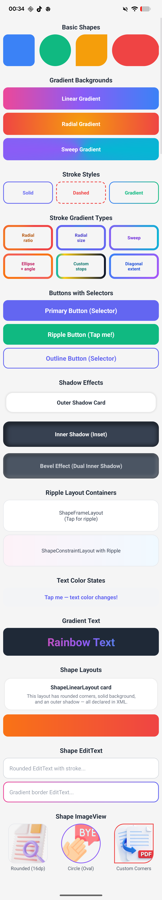
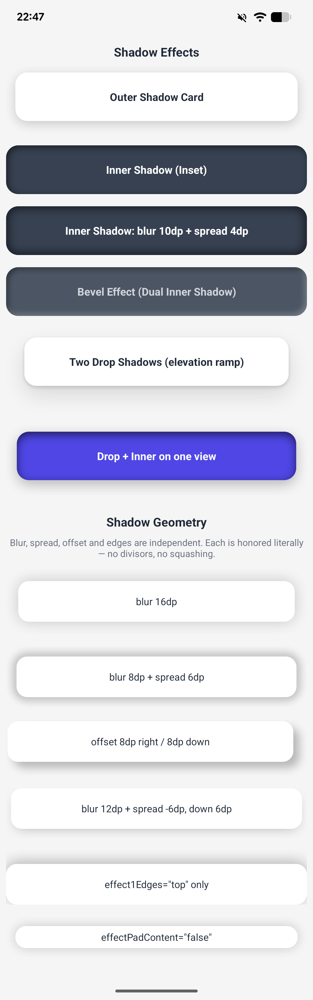

# ShapeView-ktx

[](https://central.sonatype.com/artifact/io.github.impeterwayne/shape-view)
[](https://android-arsenal.com/api?level=23)
[](https://opensource.org/licenses/Apache-2.0)

<p align="center">
  
  &nbsp;&nbsp;&nbsp;&nbsp;
  
</p>

---

## Table of contents

- [Installation](#installation)
- [Quick start](#quick-start)
- [Which view supports what](#which-view-supports-what)
- [Changing shapes at runtime](#changing-shapes-at-runtime)
- [Attribute reference](#attribute-reference)
- [Recipes](#recipes) — the fastest way to find what you need
- [Requirements](#requirements)
- [License](#license)

---

## Installation (Maven Central)

```groovy
dependencies {
    implementation 'io.github.impeterwayne:shape-view:1.0.1'
}
```

---

## Quick start

Three rules cover 90% of usage:

| Prefix | Styles… | Example |
|---|---|---|
| `shape_solid*` | the fill | `shape_solidColor` |
| `shape_stroke*` | the border | `shape_strokeSize`, `shape_strokeColor` |
| `shape_text*` | the text (text views only) | `shape_textPressedColor` |

Any of those three can take a **state suffix** (`Pressed`, `Checked`, `Disabled`, `Focused`, `Selected`) or **gradient colors** instead of a flat color.

Swap a platform view for its `Shape*` counterpart and style it inline. Nothing else changes — `ShapeButton` *is* a `Button`, `ShapeLinearLayout` *is* a `LinearLayout`, so all existing attributes, click listeners and view-binding code keep working:

```xml
<com.genesys.shape.view.ShapeButton
    android:layout_width="match_parent"
    android:layout_height="52dp"
    android:text="Continue"
    android:textColor="#FFFFFF"
    app:shape_radius="12dp"
    app:shape_solidColor="#6366F1"
    app:shape_solidPressedColor="#4F46E5"
    app:shape_solidDisabledColor="#C7D2FE" />
```

---

## Which view supports what

Every view below supports shape, corners, fill, gradient fill, stroke, gradient stroke, shadows, ring/line options and ripple. The columns show what's **extra**.

| Class | Extends | Text attrs | `Checked` state | Button drawables |
|---|---|:---:|:---:|:---:|
| `ShapeView` | `View` | – | – | – |
| `ShapeTextView` | `TextView` | ✅ | – | – |
| `ShapeButton` | `Button` | ✅ | – | – |
| `ShapeEditText` | `EditText` | ✅ | – | – |
| `ShapeImageView` | `ImageView` | – | – | – |
| `ShapeCheckBox` | `CheckBox` | ✅ | ✅ | ✅ |
| `ShapeRadioButton` | `RadioButton` | ✅ | ✅ | ✅ |
| `ShapeLinearLayout` | `LinearLayout` | – | – | – |
| `ShapeFrameLayout` | `FrameLayout` | – | – | – |
| `ShapeRelativeLayout` | `RelativeLayout` | – | – | – |
| `ShapeConstraintLayout` | `ConstraintLayout` | – | – | – |
| `ShapeRadioGroup` | `RadioGroup` | – | – | – |
| `ShapeRecyclerView` | `RecyclerView` | – | – | – |

Full package prefix: `com.genesys.shape.` — e.g. `com.genesys.shape.layout.ShapeConstraintLayout`.

---

## Changing shapes at runtime

Every attribute has a matching setter. Grab the builder, change what you need, then call the matching `into…()` to re-apply — **changes don't take effect until you do**.

```kotlin
// Fill, corners, stroke, shadows → intoBackground()
button.shapeDrawableBuilder
    .setSolidColor(Color.parseColor("#10B981"))
    .setSolidPressedColor(Color.parseColor("#059669"))
    .setRadius(24f)                 // pixels, not dp
    .intoBackground()

// Text colors and gradients → intoTextColor()
textView.textColorBuilder
    .setTextGradientColors(Color.RED, Color.BLUE)
    .intoTextColor()

// CheckBox / RadioButton icons → intoButtonDrawable()
checkBox.buttonDrawableBuilder
    .setButtonCheckedDrawable(drawable)
    .intoButtonDrawable()

// Ripple applies immediately, no into…() needed
card.rippleBuilder.rippleColor = Color.parseColor("#206366F1")
```

| Builder | Accessor | Apply with |
|---|---|---|
| `ShapeDrawableBuilder` | `getShapeDrawableBuilder()` | `intoBackground()` |
| `TextColorBuilder` | `getTextColorBuilder()` | `intoTextColor()` |
| `ButtonDrawableBuilder` | `getButtonDrawableBuilder()` | `intoButtonDrawable()` |
| `RippleBuilder` | `getRippleBuilder()` | applies on set |

Builder setters take **pixels**, so convert dp yourself (`24 * resources.displayMetrics.density`).

---

## Attribute reference

### Shape

| Attribute | Format | Default | Description |
|---|---|---|---|
| `shape_type` | enum | `rectangle` | `rectangle` · `oval` · `line` · `ring` |
| `shape_width` | dimension | view width | Explicit shape width |
| `shape_height` | dimension | view height | Explicit shape height |

### Corner radius

| Attribute | Format |
|---|---|
| `shape_radius` | dimension — all four corners |
| `shape_radiusInTopLeft` / `shape_radiusInTopStart` | dimension |
| `shape_radiusInTopRight` / `shape_radiusInTopEnd` | dimension |
| `shape_radiusInBottomLeft` / `shape_radiusInBottomStart` | dimension |
| `shape_radiusInBottomRight` / `shape_radiusInBottomEnd` | dimension |

`Start` / `End` variants flip automatically in RTL layouts; `Left` / `Right` do not. A per-corner value overrides `shape_radius`.

### Fill

| Attribute | Format | Notes |
|---|---|---|
| `shape_solidColor` | color | Default state |
| `shape_solidPressedColor` | color | |
| `shape_solidDisabledColor` | color | |
| `shape_solidFocusedColor` | color | |
| `shape_solidSelectedColor` | color | |
| `shape_solidCheckedColor` | color | `ShapeCheckBox` / `ShapeRadioButton` only |

### Fill gradient

Set `StartColor` **and** `EndColor` to switch the fill to a gradient (this replaces `shape_solidColor`). `CenterColor` is optional.

| Attribute | Format | Default | Description |
|---|---|---|---|
| `shape_solidGradientStartColor` | color | | Start color |
| `shape_solidGradientCenterColor` | color | | Center color (optional) |
| `shape_solidGradientEndColor` | color | | End color |
| `shape_solidGradientOrientation` | enum | `startToEnd` | `leftToRight` · `rightToLeft` · `topToBottom` · `bottomToTop` · `topLeftToBottomRight` · `bottomLeftToTopRight` · `topRightToBottomLeft` · `bottomRightToTopLeft`, plus RTL-aware `startToEnd` / `endToStart` / `topStartToBottomEnd` / … |
| `shape_solidGradientCenterX` · `…CenterY` | float | `0.5` | Center of a radial/sweep gradient |
| `shape_solidGradientRadiusSize` | dimension | | Radial radius, absolute |
| `shape_solidGradientRadiusRatio` | float | `0.5` | Radial radius as a ratio of half the shortest side |
| `shape_solidGradientRadiusX` · `…RadiusY` | float | `-1` (off) | Elliptical scale factors |
| `shape_solidRadialAngle` | float | `0` | Radial rotation, degrees |
| `shape_solidGradientStartPercent` | float | `0.0` | Color-stop position of the start color |
| `shape_solidGradientCenterPercent` | float | `0.5` | Color-stop position of the center color |
| `shape_solidGradientEndPercent` | float | `1.0` | Color-stop position of the end color |
| `shape_solidGradientStartX` · `…StartY` | float | orientation | Explicit linear start point, 0–1 of the view |
| `shape_solidGradientEndX` · `…EndY` | float | orientation | Explicit linear end point, 0–1 of the view |

> [!WARNING]
> `shape_solidGradientRadius` is **deprecated** in favour of the `…RadiusSize` / `…RadiusRatio` pair. It still works — a dimension is read as an absolute radius, a float as a ratio — and the explicit pair wins if both are set.

### Stroke

| Attribute | Format | Notes |
|---|---|---|
| `shape_strokeSize` | dimension | Border width; nothing draws without it |
| `shape_strokeColor` | color | Default state |
| `shape_strokePressedColor` | color | |
| `shape_strokeDisabledColor` | color | |
| `shape_strokeFocusedColor` | color | |
| `shape_strokeSelectedColor` | color | |
| `shape_strokeCheckedColor` | color | `ShapeCheckBox` / `ShapeRadioButton` only |
| `shape_strokeDashSize` | dimension | Dash length (`0` = solid) |
| `shape_strokeDashGap` | dimension | Gap between dashes |

### Stroke gradient

Identical to the fill gradient — replace the `solid` prefix with `stroke`:
`shape_strokeGradientStartColor` · `…CenterColor` · `…EndColor` · `…Type` · `…Orientation` · `…CenterX/Y` · `…RadiusSize` · `…RadiusRatio` · `…RadiusX/Y` · `shape_strokeRadialAngle` · `…StartPercent` · `…CenterPercent` · `…EndPercent` · `…StartX/Y` · `…EndX/Y`.

### Effects

Shadows are modelled on Figma's Effects panel: an ordered list of effects, each with a **type**, a color, and the same blur / spread / offset knobs. In XML the list is four numbered slots, `shape_effect1…` through `shape_effect4…`; in code it is a plain `List<ShapeEffect>` of any length.

Every knob is applied literally — `shape_effect1Blur="8dp"` blurs over 8dp on every Android version — and each slot is independent, so a view can carry two drop shadows, two inner ones, or a mix.

| Attribute (`N` = 1…4) | Format | Default | Description |
|---|---|---|---|
| `shape_effectNType` | enum | `dropShadow` | `dropShadow` (outside the shape) or `innerShadow` (inside it) |
| `shape_effectNColor` | color | `#33000000` | Effect color (also takes a selector) |
| `shape_effectNBlur` | dimension | `0` | Blur radius |
| `shape_effectNSpread` | dimension | `0` | Grows the shadow before blurring; negative values shrink it |
| `shape_effectNOffsetX` · `…OffsetY` | dimension | `0` | Offset; positive is right / down |
| `shape_effectNEdges` | flags | `all` | Edges that reserve room: `none` `left` `top` `right` `bottom` `all`. Drop shadows only |
| `shape_effectPadContent` | boolean | `true` | Add the reserved room to the view's padding too (all slots at once) |

A slot with no geometry of its own — no blur, no spread, no offset — paints nothing, so declaring only `shape_effect1Blur` and `shape_effect1Color` is enough for a plain drop shadow.

**Paint order.** Effects paint in slot order, but type wins first: every drop shadow goes behind the fill, every inner shadow over it. So order only matters between effects of the same type — which is exactly what a bevel needs (dark inner shadow first, light one over it).

**Drop shadows and the room they cost.** A drop shadow follows CSS `box-shadow`: the shape grown by the spread, moved by the offset, then blurred. It is painted inside the view, so each edge in `shape_effectNEdges` gives up `blur + spread`, shifted by the offset — `left = blur + spread − offsetX`, `right = blur + spread + offsetX`, and likewise for top/bottom, never below zero. So `blur="12dp" offsetY="4dp"` costs 8dp at the top and 16dp at the bottom, and nothing sideways once you drop `left`/`right` from the mask. With several drop shadows the view reserves the **largest** claim on each edge.

With `wrap_content` the view grows by that much and the shape comes out the size you designed. With a fixed height or `match_parent` the view can't grow, so the shape is drawn that much smaller — budget for it, or reach for `android:elevation` when you want a shadow that costs no layout space at all.

`shape_effectPadContent` (on by default) adds the same insets to the view's padding, which is what keeps text and children inside the visible shape instead of spilling over its edge at a large corner radius. Turn it off if you want to place content yourself.

**Inner shadows** take the same knobs with the same literal meaning; what differs is where the ink lands. The shape is shrunk by the spread and moved by the offset, and whatever is left uncovered is the shadow — so it gathers on the side the offset came from, exactly like `box-shadow: inset`. Because it paints inside the shape it costs no layout room, which is why `Edges` means nothing to it. Rectangles and ovals only; lines and rings have no interior to inset into.

**Two limits worth knowing.** `Spread` applies to rectangles and ovals; rings and lines are only offset, since there's no one sensible way to grow a ring outward. And the effects rasterize into bitmaps sized to the view (downscaled past ~512×512), so the view stays hardware-accelerated — only dashed strokes still force a software layer.

**In code**, the same list is available on the builder:

```kotlin
card.shapeDrawableBuilder
    .clearEffects()
    .addEffect(
        // color, blur, spread, offsetX, offsetY
        ShapeEffect.dropShadow(0x26000000, 12, 0, 0, 6)
            .setEdges(ShapeEffect.EDGE_TOP or ShapeEffect.EDGE_BOTTOM)
    )
    .addEffect(ShapeEffect.innerShadow(0x40FFFFFF, 6, 0, -3, -3))
    .intoBackground()
```

All values are pixels, and nothing is applied until `intoBackground()`.

### Ring (`shape_type="ring"`)

| Attribute | Format | Default | Description |
|---|---|---|---|
| `shape_ringInnerRadiusSize` | dimension | `-1` (use ratio) | Inner radius, absolute |
| `shape_ringInnerRadiusRatio` | float | `3.0` | Inner radius = ring size ÷ ratio |
| `shape_ringThicknessSize` | dimension | `-1` (use ratio) | Ring thickness, absolute |
| `shape_ringThicknessRatio` | float | `9.0` | Thickness = ring size ÷ ratio |

### Line (`shape_type="line"`)

| Attribute | Format | Default | Description |
|---|---|---|---|
| `shape_lineGravity` | flags | `center` | `top` · `bottom` · `left` · `right` · `start` · `end` · `center` |

### Text — text views only

| Attribute | Format | Description |
|---|---|---|
| `shape_textColor` | color | Default text color |
| `shape_textPressedColor` | color | |
| `shape_textDisabledColor` | color | |
| `shape_textFocusedColor` | color | |
| `shape_textSelectedColor` | color | |
| `shape_textCheckedColor` | color | `ShapeCheckBox` / `ShapeRadioButton` only |
| `shape_textStartColor` | color | Gradient start |
| `shape_textCenterColor` | color | Gradient center (optional) |
| `shape_textEndColor` | color | Gradient end |
| `shape_textGradientOrientation` | enum | `horizontal` (default) · `vertical` |
| `shape_textStrokeColor` | color | Text outline color |
| `shape_textStrokeSize` | dimension | Text outline width |

### Button drawables — `ShapeCheckBox` / `ShapeRadioButton` only

`shape_buttonDrawable` · `shape_buttonPressedDrawable` · `shape_buttonCheckedDrawable` · `shape_buttonDisabledDrawable` · `shape_buttonFocusedDrawable` · `shape_buttonSelectedDrawable` — all `reference`.

### Ripple

| Attribute | Format | Default | Description |
|---|---|---|---|
| `shape_ripple_enabled` | boolean | `false` | Enables the ripple **and sets the view clickable** |
| `shape_ripple_color` | color | `#20FFFFFF` | Ripple color |
| `shape_ripple_radius` | dimension | corner radii | Overrides the ripple mask rounding |

---

## Recipes

### Card with rounded corners and a shadow

```xml
<com.genesys.shape.layout.ShapeLinearLayout
    android:layout_width="match_parent"
    android:layout_height="wrap_content"
    android:orientation="vertical"
    android:padding="16dp"
    app:shape_radius="16dp"
    app:shape_solidColor="#FFFFFF"
    app:shape_effect1Color="#30000000"
    app:shape_effect1Blur="12dp"
    app:shape_effect1OffsetY="4dp" />
```

> [!NOTE]
> Shadows are **effects**, declared in numbered slots the way rows stack in Figma's Effects panel. A slot with no `Type` is a drop shadow — see [Effects](#effects) for the full model.
>
> A drop shadow is painted **inside** the view's bounds, so the view has to give up room for it. How much, per edge, is `blur + spread`, shifted by the offset. With `wrap_content` the view simply grows and the shape keeps its size; with a fixed height the shape is drawn that much smaller than the height you asked for.

### Bottom sheet: shadow on the top edge only

By default every edge reserves room, which leaves a gap on the three sides a sheet needs to keep flush. Each effect carries its own `Edges` mask, picking the edges that pay for that shadow — the rest let it run off and be clipped.

```xml
<com.genesys.shape.layout.ShapeLinearLayout
    android:layout_width="match_parent"
    android:layout_height="wrap_content"
    android:orientation="vertical"
    app:shape_radiusInTopLeft="24dp"
    app:shape_radiusInTopRight="24dp"
    app:shape_effect1Color="#59000000"
    app:shape_effect1Blur="20dp"
    app:shape_effect1OffsetY="-6dp"
    app:shape_effect1Edges="top"
    app:shape_solidColor="#FFFFFF" />
```

### Button that reacts to press / disable

State colors need no selector XML — just add the suffixed attribute.

```xml
<com.genesys.shape.view.ShapeButton
    android:layout_width="match_parent"
    android:layout_height="52dp"
    android:text="Submit"
    app:shape_radius="26dp"
    app:shape_solidColor="#6366F1"
    app:shape_solidPressedColor="#4F46E5"
    app:shape_solidDisabledColor="#E5E7EB"
    app:shape_textColor="#FFFFFF"
    app:shape_textDisabledColor="#9CA3AF" />
```

Available states: `Pressed` · `Disabled` · `Focused` · `Selected` on every view, plus `Checked` on `ShapeCheckBox` / `ShapeRadioButton`.

### Outlined ("ghost") button and dashed borders

```xml
<!-- Solid 1dp outline that turns indigo while pressed -->
<com.genesys.shape.view.ShapeButton
    android:layout_width="match_parent"
    android:layout_height="52dp"
    android:text="Cancel"
    app:shape_radius="26dp"
    app:shape_solidColor="#00000000"
    app:shape_strokeSize="1dp"
    app:shape_strokeColor="#D1D5DB"
    app:shape_strokePressedColor="#6366F1" />

<!-- Dashed drop zone -->
<com.genesys.shape.layout.ShapeFrameLayout
    android:layout_width="match_parent"
    android:layout_height="120dp"
    app:shape_radius="12dp"
    app:shape_solidColor="#F9FAFB"
    app:shape_strokeSize="2dp"
    app:shape_strokeColor="#9CA3AF"
    app:shape_strokeDashSize="8dp"
    app:shape_strokeDashGap="6dp" />
```

### Input field with a focus highlight

```xml
<com.genesys.shape.view.ShapeEditText
    android:layout_width="match_parent"
    android:layout_height="48dp"
    android:hint="Email address"
    android:paddingHorizontal="16dp"
    app:shape_radius="8dp"
    app:shape_solidColor="#FFFFFF"
    app:shape_strokeSize="1dp"
    app:shape_strokeColor="#D1D5DB"
    app:shape_strokeFocusedColor="#6366F1"
    app:shape_solidFocusedColor="#F5F3FF" />
```

### Gradient background

Set a start and an end color; the center color is optional. Orientation defaults to **start → end**.

```xml
<!-- Linear -->
<com.genesys.shape.view.ShapeView
    android:layout_width="match_parent"
    android:layout_height="120dp"
    app:shape_radius="16dp"
    app:shape_solidGradientStartColor="#6366F1"
    app:shape_solidGradientEndColor="#EC4899"
    app:shape_solidGradientOrientation="topLeftToBottomRight" />

<!-- Radial glow, centred slightly above the middle -->
<com.genesys.shape.view.ShapeView
    android:layout_width="200dp"
    android:layout_height="200dp"
    app:shape_type="oval"
    app:shape_solidGradientType="radial"
    app:shape_solidGradientStartColor="#FDE68A"
    app:shape_solidGradientEndColor="#F59E0B"
    app:shape_solidGradientCenterX="0.5"
    app:shape_solidGradientCenterY="0.35"
    app:shape_solidGradientRadiusRatio="0.9" />

<!-- Sweep / conic -->
<com.genesys.shape.view.ShapeView
    android:layout_width="120dp"
    android:layout_height="120dp"
    app:shape_type="oval"
    app:shape_solidGradientType="sweep"
    app:shape_solidGradientStartColor="#6366F1"
    app:shape_solidGradientCenterColor="#EC4899"
    app:shape_solidGradientEndColor="#6366F1" />
```

**Matching a Figma gradient exactly?** Use the extent and stop attributes instead of an orientation enum:

```xml
app:shape_solidGradientStartX="0.1"
app:shape_solidGradientStartY="0.0"
app:shape_solidGradientEndX="0.9"
app:shape_solidGradientEndY="1.0"
app:shape_solidGradientStartPercent="0.15"
app:shape_solidGradientEndPercent="0.85"
```

### Gradient border

The stroke accepts the same gradient options as the fill — swap the `solid` prefix for `stroke`.

```xml
<com.genesys.shape.layout.ShapeFrameLayout
    android:layout_width="match_parent"
    android:layout_height="80dp"
    app:shape_radius="16dp"
    app:shape_solidColor="#111827"
    app:shape_strokeSize="2dp"
    app:shape_strokeGradientStartColor="#6366F1"
    app:shape_strokeGradientEndColor="#EC4899"
    app:shape_strokeGradientOrientation="leftToRight" />
```

### Ripple on anything

Works on every view and layout in the library, not just buttons. Enabling it also makes the view **clickable automatically**.

```xml
<com.genesys.shape.layout.ShapeConstraintLayout
    android:layout_width="match_parent"
    android:layout_height="80dp"
    app:shape_radius="16dp"
    app:shape_solidColor="#FFFFFF"
    app:shape_ripple_enabled="true"
    app:shape_ripple_color="#206366F1" />
```

The ripple is masked to the view's corner radii by default; `shape_ripple_radius` overrides that mask when you want a different rounding.

### Rounded / circular images

`ShapeImageView` clips its own content, so it works with any image loader.

```xml
<!-- Avatar with a ring -->
<com.genesys.shape.view.ShapeImageView
    android:layout_width="64dp"
    android:layout_height="64dp"
    android:scaleType="centerCrop"
    android:src="@drawable/avatar"
    app:shape_type="oval"
    app:shape_strokeSize="2dp"
    app:shape_strokeColor="#6366F1" />

<!-- Card thumbnail: rounded top corners only -->
<com.genesys.shape.view.ShapeImageView
    android:layout_width="match_parent"
    android:layout_height="160dp"
    android:scaleType="centerCrop"
    android:src="@drawable/cover"
    app:shape_radiusInTopLeft="16dp"
    app:shape_radiusInTopRight="16dp" />
```

For RTL-aware corners use the `Start` / `End` variants (`shape_radiusInTopStart`, …) instead of `Left` / `Right`.

### Gradient and outlined text

```xml
<!-- Gradient fill -->
<com.genesys.shape.view.ShapeTextView
    android:layout_width="wrap_content"
    android:layout_height="wrap_content"
    android:text="Premium"
    android:textSize="28sp"
    android:textStyle="bold"
    app:shape_textStartColor="#6366F1"
    app:shape_textCenterColor="#A855F7"
    app:shape_textEndColor="#EC4899"
    app:shape_textGradientOrientation="horizontal" />

<!-- Outlined text -->
<com.genesys.shape.view.ShapeTextView
    android:layout_width="wrap_content"
    android:layout_height="wrap_content"
    android:text="OUTLINE"
    android:textSize="32sp"
    app:shape_textColor="#FFFFFF"
    app:shape_textStrokeColor="#111827"
    app:shape_textStrokeSize="2dp" />
```

### Custom CheckBox / RadioButton icons

```xml
<com.genesys.shape.view.ShapeCheckBox
    android:layout_width="wrap_content"
    android:layout_height="wrap_content"
    android:text="Remember me"
    app:shape_buttonDrawable="@drawable/ic_check_off"
    app:shape_buttonCheckedDrawable="@drawable/ic_check_on"
    app:shape_buttonDisabledDrawable="@drawable/ic_check_disabled"
    app:shape_textCheckedColor="#6366F1" />
```

`ShapeCheckBox` and `ShapeRadioButton` are also the only views that accept `shape_solidCheckedColor` / `shape_strokeCheckedColor` / `shape_textCheckedColor` — handy for chip-style selectable pills:

```xml
<com.genesys.shape.view.ShapeCheckBox
    android:layout_width="wrap_content"
    android:layout_height="36dp"
    android:button="@null"
    android:gravity="center"
    android:paddingHorizontal="16dp"
    android:text="Design"
    app:shape_radius="18dp"
    app:shape_solidColor="#F3F4F6"
    app:shape_solidCheckedColor="#6366F1"
    app:shape_textColor="#374151"
    app:shape_textCheckedColor="#FFFFFF" />
```

### Rings and dividers

Two shape types that need no extra views:

```xml
<!-- Ring: a donut, sized by ratio or absolute thickness -->
<com.genesys.shape.view.ShapeView
    android:layout_width="80dp"
    android:layout_height="80dp"
    app:shape_type="ring"
    app:shape_solidColor="#6366F1"
    app:shape_ringInnerRadiusRatio="2.5"
    app:shape_ringThicknessSize="6dp" />

<!-- Line: a divider that fills the view and aligns where you want -->
<com.genesys.shape.view.ShapeView
    android:layout_width="match_parent"
    android:layout_height="24dp"
    app:shape_type="line"
    app:shape_strokeSize="1dp"
    app:shape_strokeColor="#E5E7EB"
    app:shape_lineGravity="center" />
```

### Neumorphic bevel (two inner shadows)

One dark inner shadow plus one light one gives the pressed/embossed look. Slots paint in order, so the light highlight goes second.

```xml
<com.genesys.shape.layout.ShapeConstraintLayout
    android:layout_width="200dp"
    android:layout_height="200dp"
    app:shape_radius="24dp"
    app:shape_solidColor="#E0E5EC"
    app:shape_effect1Type="innerShadow"
    app:shape_effect1Color="#40000000"
    app:shape_effect1Blur="6dp"
    app:shape_effect1OffsetX="4dp"
    app:shape_effect1OffsetY="4dp"
    app:shape_effect2Type="innerShadow"
    app:shape_effect2Color="#80FFFFFF"
    app:shape_effect2Blur="6dp"
    app:shape_effect2OffsetX="-4dp"
    app:shape_effect2OffsetY="-4dp" />
```

### Elevation ramp (two drop shadows)

A tight dark shadow for contact plus a wide soft one for ambience — the same recipe Material and Figma use for a raised card.

```xml
<com.genesys.shape.layout.ShapeLinearLayout
    android:layout_width="match_parent"
    android:layout_height="wrap_content"
    android:padding="16dp"
    app:shape_radius="16dp"
    app:shape_solidColor="#FFFFFF"
    app:shape_effect1Color="#26000000"
    app:shape_effect1Blur="4dp"
    app:shape_effect1OffsetY="2dp"
    app:shape_effect2Color="#1F000000"
    app:shape_effect2Blur="24dp"
    app:shape_effect2OffsetY="12dp" />
```

---

## Requirements

| | |
|---|---|
| **Min SDK** | 23 |
| **Compile SDK** | 36 |
| **Language** | Java (fully usable from Kotlin) |

## License

```
Copyright 2026 impeterwayne

Licensed under the Apache License, Version 2.0 (the "License");
you may not use this file except in compliance with the License.
You may obtain a copy of the License at

    http://www.apache.org/licenses/LICENSE-2.0

Unless required by applicable law or agreed to in writing, software
distributed under the License is distributed on an "AS IS" BASIS,
WITHOUT WARRANTIES OR CONDITIONS OF ANY KIND, either express or implied.
See the License for the specific language governing permissions and
limitations under the License.
```
